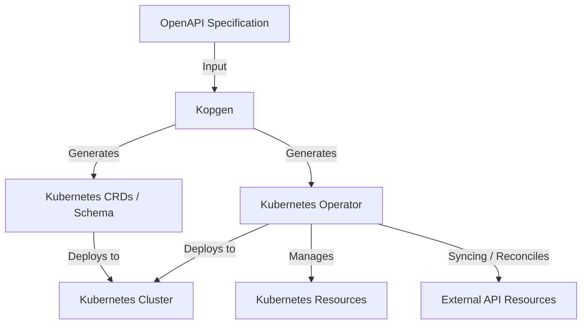

# Kopgen

Welcome to the Kopgen documentation. This project helps you generate Kubernetes Custom Resource Definitions (CRDs) and operators from a standard OpenAPI Specification using Rust.

## Table of Contents

1. [Introduction](introduction.md)
2. [Getting Started](getting_started.md)
3. [Configuration](configuration.md)
4. [Usage](usage.md)
5. [Examples](examples.md)
6. [Contributing](contributing.md)
7. [License](license.md)

## Architecture Overview

